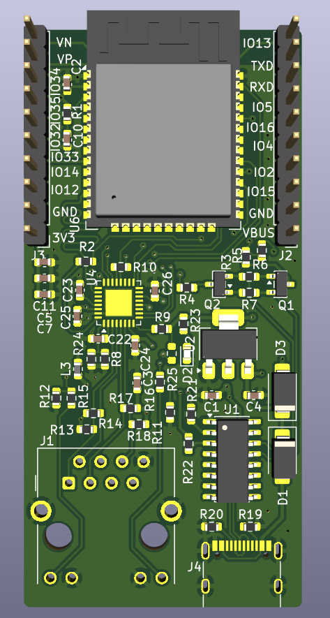
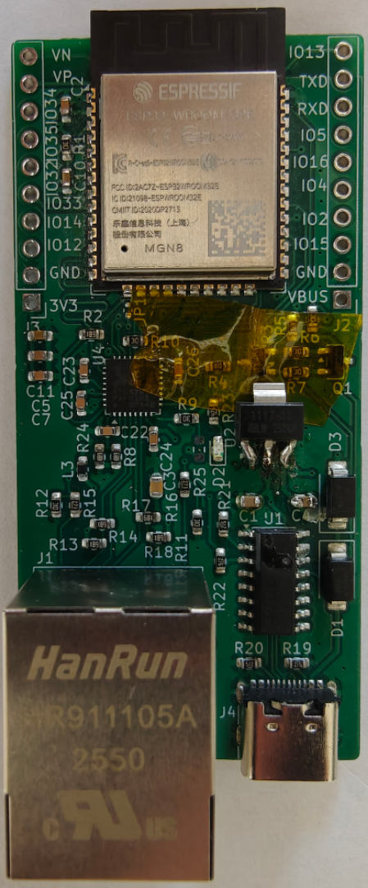

# ESP32-RTL8201F-devboard
A simple ESP32 devboard with WiFi and Ethernet using the RTL8201F transceiver including an onboard USB-C-port for power, programming and serial console.

## Design


The schematics are based on the [esp-32-poe-dev project by @jorticus](https://github.com/jorticus/esp32-poe-dev) but using the ESP32-WROOM-32E module instead of a barebone ESP32.

This board is designed as a 4-layer PCB and is optimized for cheap assembly with JLCPCB. So using basic parts where possible and a custom ESP32-WROOM-32E footrpint so the minimum via-hole-size is 0.3mm.

## Assembly


The boards were fully assembled by JLCPCB (except for the pinheaders).
The necessary production files are included under pcb/jilcpcb.

In the first interation I chose the wrong 3.3V LDO and had to amnually swap those. The uploaded board- and assembly-files are already fixed.

## Development using platform.io
Save the [esp32-rtl8201f-devboard.json](esp32-rtl8201f-devboard.json) into the `boards` directory of your platform.io project. Creating the folder if it doesn't exist yet.

Select the board in your `platformio.ini`
```ini
[env:esp32dev]
monitor_speed=115200
platform = espressif32
board = esp32-rtl8201f-devboard
framework = arduino
```
Now you can `#include <ETH.h>` and call `ETH.begin();` in your code.
Check out the [firmware-examples](firmware-examples) for more details.

## Stability
The main goal was to have a more stable link than the onboard wifi and with packet-loss around .00003% in my test I think it's pretty stable.
